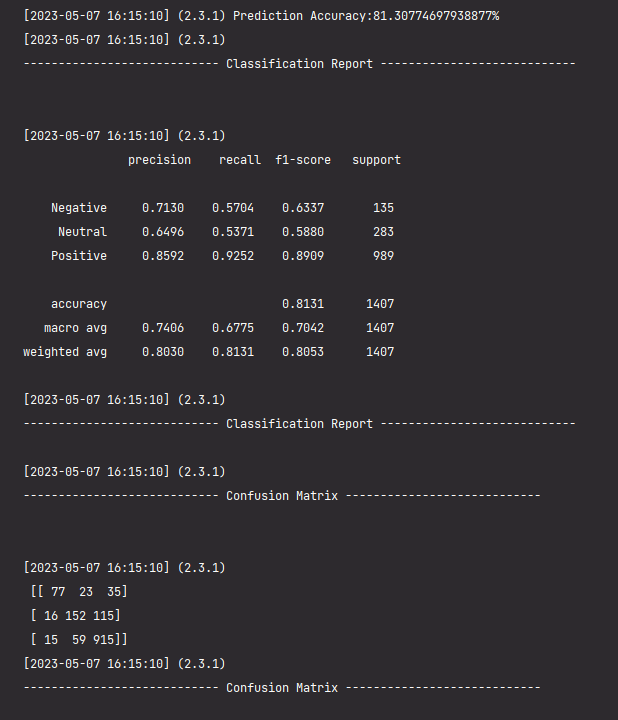

=== 25 April 2023 ===
- Mengerjakan syntax convert data json to absa dataset
- Training english review with the great result without data preprocessing (i.e. typo, informal words, etc)

=== 26 April 2023 ===
- Trial training bahasa indonesia
- Fix issue modeling with indobert
- get 77.04% accuracy with 10 epoch
- get 67.82% F1 score with 10 epoch
- Pre Trained Model : indobenchmark/indobert-base-p1
- Data Preprocessing : None

=== 27 April 2023 ===
- Trial training bahasa indonesia

Running 1: Done
- Pre-Trained Model : IndoBERT-base-p2
- get 77.96% accuracy with 10 epoch
- get 69.13% F1 score with 10 epoch
- Data Preprocessing : None

Running 2: Done
- Pre-Trained Model : IndoBERT-base-p2
- Data Preprocessing : None

Running 3: running
- Pre-Trained Model : XLM-R base
- Data Preprocessing : None
- Dropout : 0.2
- Epoch : 10
- Loss : 0,06

Running 4: soon
- Pre-Trained Model : cahya/bert-base-indonesian-522M
- Data Preprocessing : None

=== 30 April 2023 ===
- Create Visualisasi Data ABSA
- Fixing dataset issue and change to use 505 dataset

Running 1 : 
- Pre-Trained Model : Deberta-V3
- Data Preprocessing : None
- Loss : 0.1
- Epoch : 10
- Accuracy : 0.78
- Checkpoint Path : D:\project\PyABSA\checkpoints\fast_lsa_t_v2_AttractionReviewEn_acc_90.72_f1_84.53

=== 06 Mei 2023 ===
- preprocessing indonesian and english set by removing the outlier

=== 07 Mei 2023 ===
Running Model:
- Pre-Trained Model : indobenchmark/indobert-base-p2
- Data Preprocessing : True
- Dataset Code : 508
- Minimum Loss = 0.3
- 
Epoch:  0 | Smooth Loss: 0.7286: 100%|██████████| 574/574 [11:33<00:00,  1.21s/it, Dev Acc:73.99(max:75.12) Dev F1:60.68(max:60.68)]
Epoch:  1 | Smooth Loss: 0.6292: 100%|██████████| 574/574 [11:31<00:00,  1.21s/it, Dev Acc:76.69(max:78.32) Dev F1:63.43(max:66.51)]
Epoch:  2 | Smooth Loss: 0.5468: 100%|██████████| 574/574 [11:31<00:00,  1.20s/it, Dev Acc:74.91(max:78.89) Dev F1:67.86(max:68.53)]
Epoch:  3 | Smooth Loss: 0.4776: 100%|██████████| 574/574 [11:25<00:00,  1.20s/it, Dev Acc:77.61(max:79.82) Dev F1:64.31(max:70.16)]
Epoch:  4 | Smooth Loss: 0.4244: 100%|██████████| 574/574 [11:29<00:00,  1.20s/it, Dev Acc:77.61(max:81.31) Dev F1:63.44(max:70.55)]
Epoch:  5 | Smooth Loss: 0.3802: 100%|██████████| 574/574 [11:20<00:00,  1.19s/it, Dev Acc:77.83(max:81.31) Dev F1:64.75(max:70.55)]
Epoch:  6 | Smooth Loss: 0.3432: 100%|██████████| 574/574 [11:31<00:00,  1.21s/it, Dev Acc:76.40(max:81.31) Dev F1:64.74(max:70.55)]
Epoch:  7 | Smooth Loss: 0.3153: 100%|██████████| 574/574 [11:23<00:00,  1.19s/it, Dev Acc:79.18(max:81.31) Dev F1:68.11(max:70.55)]
Epoch:  8 | Smooth Loss: 0.3065:  35%|██████████| 574/574 [11:23<00:00,  1.19s/it, Dev Acc:80.18(max:81.31) Dev F1:68.11(max:70.55)]

- Result :
  - Accuracy : 81.13% (validation)
  - F1 Score : 70.42% (validation)
  - 

Running Model 2 :
- Pre-Trained Model : indobenchmark/indobert-base-p2
- Data Preprocessing : True
- Dataset Code : 508
- Minimum Loss = 0.3
- Config : 
  - config = APC.APCConfigManager.get_apc_config_indonesia()
  - config.model = APCModelList.FAST_LSA_T_V2
  - config.pretrained_bert = 'indobenchmark/indobert-base-p2'
  - config.num_epoch = 30
  - config.batch_size = 16
  - config.max_seq_len = 90
  - config.optimizer = 'adamw'
  - config.dropout = 0.3
  - config.lsa = True
  - config.window = 'lr'
  - config.learning_rate = 0.00002
  - config.l2reg = 0.00001
  - config.eta = 1  # control the k values
  - config.eta_lr = 0.01

=== 12 Mei 2023 ===
Running 1 :
- log : fast_lsa_t_v2_20230512 191445
- Result :
  - Epoch:  0 | Smooth Loss: 0.3224: 100%|██████████| 412/412 [14:40<00:00,  2.14s/it, Dev Acc:89.24(max:89.94) Dev F1:82.81(max:84.20)]
  - Epoch:  1 | Smooth Loss: 0.2535: 100%|██████████| 412/412 [14:03<00:00,  2.05s/it, Dev Acc:89.18(max:90.25) Dev F1:82.17(max:84.90)]
  - Epoch:  2 | Smooth Loss: 0.2081: 100%|██████████| 412/412 [14:03<00:00,  2.05s/it, Dev Acc:89.37(max:90.25) Dev F1:83.24(max:84.90)]
  - Epoch:  3 | Smooth Loss: 0.1774: 100%|██████████| 412/412 [13:54<00:00,  2.02s/it, Dev Acc:89.05(max:90.25) Dev F1:82.80(max:84.90)]
  - Epoch:  4 | Smooth Loss: 0.1556: 100%|██████████| 412/412 [14:03<00:00,  2.05s/it, Dev Acc:89.37(max:90.25) Dev F1:83.42(max:84.90)]
  - Epoch:  5 | Smooth Loss: 0.1390: 100%|██████████| 412/412 [14:02<00:00,  2.05s/it, Dev Acc:89.24(max:90.51) Dev F1:82.52(max:85.52)]
  - Epoch:  6 | Smooth Loss: 0.1264: 100%|██████████| 412/412 [13:55<00:00,  2.03s/it, Dev Acc:89.75(max:90.51) Dev F1:83.69(max:85.52)]
  - Epoch:  7 | Smooth Loss: 0.1169: 100%|██████████| 412/412 [14:01<00:00,  2.04s/it, Dev Acc:88.99(max:90.51) Dev F1:81.94(max:85.52)]
  - Epoch:  8 | Smooth Loss: 0.1083: 100%|██████████| 412/412 [13:49<00:00,  2.01s/it, Dev Acc:88.54(max:90.51) Dev F1:81.06(max:85.52)]
  - Epoch:  9 | Smooth Loss: 0.1025: 100%|██████████| 412/412 [13:57<00:00,  2.03s/it, Dev Acc:89.30(max:90.51) Dev F1:82.91(max:85.52)]
  - Epoch: 10 | Smooth Loss: 0.0958: 100%|██████████| 412/412 [13:49<00:00,  2.01s/it, Dev Acc:89.24(max:90.51) Dev F1:82.84(max:85.52)]
  - Epoch: 11 | Smooth Loss: 0.0902: 100%|██████████| 412/412 [13:50<00:00,  2.02s/it, Dev Acc:88.86(max:90.51) Dev F1:81.82(max:85.52)]
  - Epoch: 12 | Smooth Loss: 0.0859: 100%|██████████| 412/412 [14:20<00:00,  2.09s/it, Dev Acc:89.24(max:90.51) Dev F1:83.19(max:85.52)]

=== 18 Mei 2023 ===
Running 1 :
  - Checkpoint result = fast_lsa_t_v2_AttractionReviewEn_acc_90.51_f1_85.52
  - log = fast_lsa_t_v2_20230518 170350
  - valid set test : 

=== 22 Mei 2023 ===
Running ATEPC :
- Pre-Trained Model : microsoft/deberta-v3-base
- Data Preprocessing : True
- Dataset Code : 512
- log : fast_lcf_atepc_20230522 040039
- checkpoint : fast_lcf_atepc_attraction_cdm_apcacc_90.41_apcf1_85.05_atef1_87.16