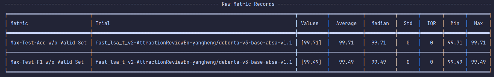

=== 25 April 2023 ===
- Mengerjakan syntax convert data json to absa dataset
- Training english review with the great result without data preprocessing (i.e. typo, informal words, etc)

=== 26 April 2023 ===
- Trial training bahasa indonesia
- Fix issue modeling with indobert
- get 77.04% accuracy with 10 epoch
- get 67.82% F1 score with 10 epoch
- Pre Trained Model : indobenchmark/indobert-base-p1
- Data Preprocessing : None

=== 27 April 2023 ===
- Trial training bahasa indonesia

Running 1:
- Pre-Trained Model : IndoBERT-large-p2
- 