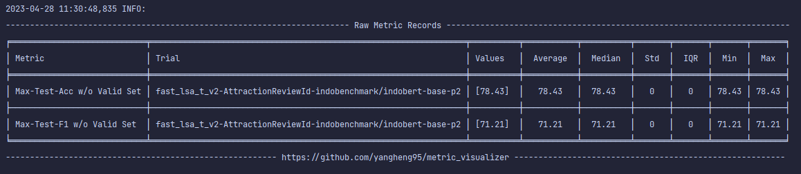
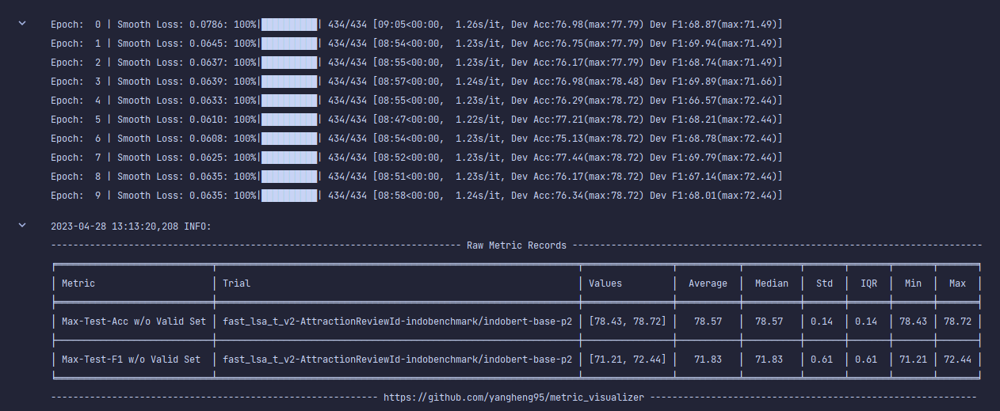
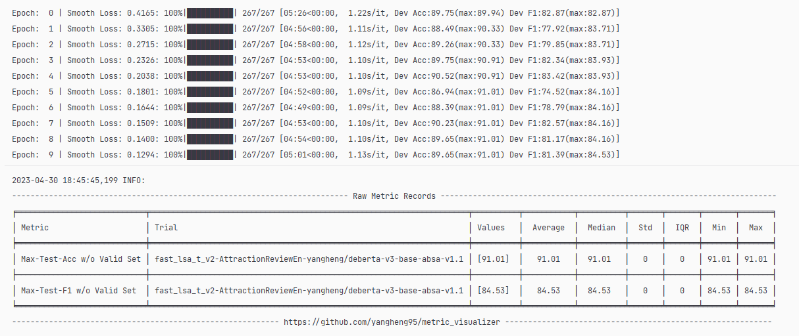
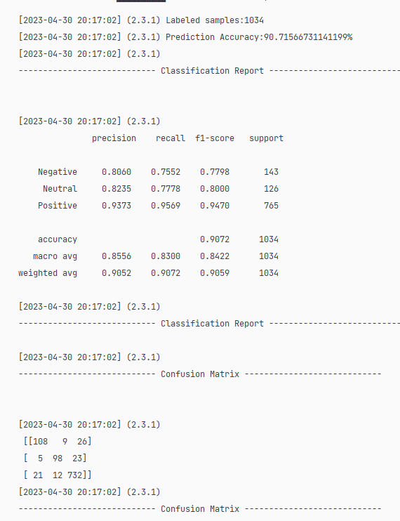

=== 25 April 2023 ===
- Mengerjakan syntax convert data json to absa dataset
- Training english review with the great result without data preprocessing (i.e. typo, informal words, etc)

=== 26 April 2023 ===
- Trial training bahasa indonesia
- Fix issue modeling with indobert
- get 77.04% accuracy with 10 epoch
- get 67.82% F1 score with 10 epoch
- Pre Trained Model : indobenchmark/indobert-base-p1
- Data Preprocessing : None

=== 27 April 2023 ===
- Trial training bahasa indonesia

Running 1: Done
- Pre-Trained Model : IndoBERT-base-p2
- get 77.96% accuracy with 10 epoch
- get 69.13% F1 score with 10 epoch
- Data Preprocessing : None

Running 2: Done
- Pre-Trained Model : IndoBERT-base-p2
- Data Preprocessing : None

Running 3: running
- Pre-Trained Model : XLM-R base
- Data Preprocessing : None
- Dropout : 0.2
- Epoch : 10
- Loss : 0,06

Running 4: soon
- Pre-Trained Model : cahya/bert-base-indonesian-522M
- Data Preprocessing : None

=== 30 April 2023 ===
- Create Visualisasi Data ABSA
- Fixing dataset issue and change to use 505 dataset

Running 1 : 
- Pre-Trained Model : Deberta-V3
- Data Preprocessing : None
- Loss : 0.1
- Epoch : 10
- Accuracy : 0.78
- Checkpoint Path : D:\project\PyABSA\checkpoints\fast_lsa_t_v2_AttractionReviewEn_acc_90.72_f1_84.53

